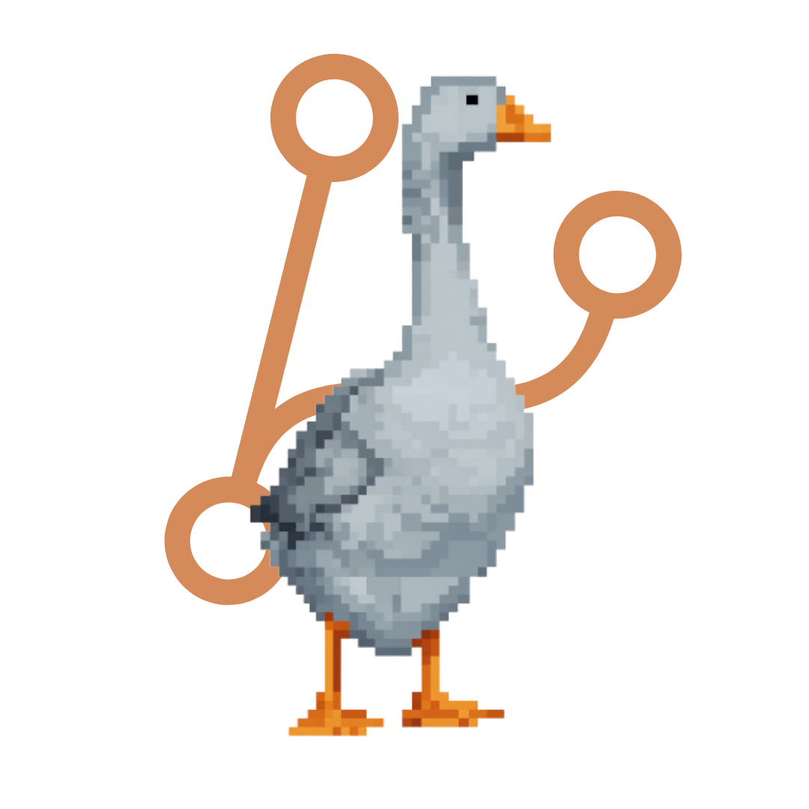

  +Franciszek+Dawid;%3E+Bridging+Communication+with+Tech.;%3E+Journalist,+UX+Advocate,+Developer.;%3E+Crafting+stories.+Writing+code.;%3E+Founder+of+the+Gonsior+Crew.;%3E+Turning+ideas+into+real-world+projects.;%3E+OSINT+trained.+Cybersec+aware.;%3E+Tatry+Enjoyer.;%3E+Ready+for+the+next+challenge." alt="Typing Effect" />

  

  🇵🇱 Polish (Native) | 🇬🇧 English (C1) | 🇫🇷 French (A2)

 

##  My Stack

###  Core Focus & Specialization
*Data analysis, OSINT automation, and database architecture:*

  

###  Familiar With / Broad Knowledge
*Web tech and systems I use for building custom dashboards and data collection tools:*

  

---

##  About me

### 🎓 Academic Background
I am a student of **Digital Information Processing** at the prestigious **Jagiellonian University in Krakow**—founded in 1364, making it not only the oldest higher education institution in Poland but also one of the oldest in all of Europe. 

At this very same university, I previously earned my **BA in Journalism and Social Communication**, graduating with the highest honors (Grade: 5.0). My bachelor's thesis, <strong><a href="https://ruj.uj.edu.pl/handle/item/554267" target="_blank">"Toxic communication in multiplayer games: a Polish player’s perspective"</a></strong>, was recommended for publication by both my supervisor and reviewer. Currently, I am bridging my expertise in social communication with technical engineering to create more conscious and human-centric technology.

### 🚀 Experience & Leadership

**Open Source Contributor** — <em><a href="https://github.com/tauri-apps" target="_blank">Tauri</a></em> & <em><a href="https://github.com/LadybirdBrowser" target="_blank">Ladybird Browser</a></em> (2026-Present) 
Actively supporting the open-source community by improving documentation and resolving entry-level issues. My focus is on making these complex projects more accessible to newcomers while expanding my own technical understanding from the ground up.

**Founder & Leader** — <em><a href="https://github.com/GonsiorHack" target="_blank">Gonsior Organization</a></em> (2026–Present) 
Expanding an ambitious group of students joining forces to build real-world projects. Recently, we participated in **HackYeah 2025**, where we built <a href="https://github.com/callhestia/Reign-of-Abaddon.git" target="_blank">Reign of Abaddon</a>. My focus is bringing together young minds, competing in hackathons, and gaining hands-on industry experience.

**Environmental Analyst** — <em><a href="https://ek-kom.pl/en/" target="_blank">EKKOM</a></em> & <em><a href="https://tondos.eu/" target="_blank">Tondos</a></em> (2024–2026) 
Conducted critical environmental measurements and data collection for the General Directorate for National Roads and Highways (GDDKiA), ensuring infrastructure compliance.

**Digital Communications & UX Specialist** — <em><a href="https://rwhunt.pl/" target="_blank">RW Hunt</a></em> (2023–2024) 
Managed the digital presence and online store UX for a specialized retail brand. Spearheaded content creation, product photography, and social media strategy, driving a **198% increase in organic reach** (29.3k views) with zero ad spend.

**Radio Host & Journalist** — <em><a href="https://ujot.fm/" target="_blank">UJOT FM</a></em> (2023–Present) 
Hosting original broadcasts and Spotify podcasts covering social and cultural topics. Managing sound engineering, live reporting, and social media. Authored articles and conducted an exclusive interview with mountaineering legend <a href="https://ujot.fm/reinhold-messner-czlowiek-wielu-twarzy-ale-jednej-mimiki-pierwsza-wizyta-w-polsce-po-10-latach/" target="_blank">Reinhold Messner</a>. Proudly represented the station on the pitch during the 2026 Student Media Football Match (UJOT FM vs UJOT TV).

---

##  Featured Projects

**<a href="https://github.com/callhestia/zawahe-mobile-app-design.git" target="_blank">🚗 Intelligent Fuel Ecosystem</a>**
A comprehensive UI/UX concept for a mobile platform solving information asymmetry in the fuel market. Designed in Figma using Atomic Design methodology. It features a "One-Tap Update" for crowdsourced live prices, Route Efficiency mapping, and EV readiness. 

**<a href="https://github.com/callhestia/strona-dzialalnosci-pielegniarskiej.git" target="_blank">🏥 Nursing Services</a>**
A professional, responsive medical SPA built with **SvelteKit (Svelte 5)**, **TypeScript**, and **Tailwind CSS**. Optimized for elderly users with High-Contrast UI, featuring a Formspree-integrated reservation system, smooth Intersection Observer animations, and Vercel deployment.

---

##  Certificates & Achievements

**OSINT (Open Source Intelligence)** — *zSecurity (Jan 2025)*  
Certified in practical techniques for open-source intelligence gathering, digital footprint analysis, and data verification.

**Prompt Engineering** — *Sololearn (Oct 2025)* 
Demonstrated theoretical and practical understanding of interacting with and optimizing Large Language Models.

**Media of the Future (Media Przyszłości)** — (Sep 2025) *TVN, WP, UW* 
Active participation in a major national conference dedicated to shaping the new generation of journalism and the modern media landscape.

**Future Skills & Labor Market Trends** — *Jagiellonian University (Jan 2023)* 
Academic workshop on futurology applied to personal competence development ("How to be the Lem of your own skills").

**Cybersecurity Basics** — *Jagiellonian University (Oct 2022)* 
Intensive training on threat actors, motivations, and attack vectors against modern IT systems.

---

##  Volunteering & Social Impact

**Secretary & Former Volunteer Caregiver** — <em><a href="https://www.facebook.com/ktpsimumunki/" target="_blank">KTPSI "Mumunki"</a></em> 
KTPSI "Mumunki" supports individuals with disabilities through specialized camps and integration trips. I manage administrative operations and legal compliance, ensuring operational transparency. 
  **Support us:** You can donate **1.5% of your tax** to help us organize future camps! Use **KRS: 0000270261** with specific goal: **MUMINKI 19764**.

**Guest Speaker & Alumni Mentor** — <em><a href="http://www.zsokluczbork.pl/web.n4?go=812" target="_blank">ZSO Kluczbork</a></em> 
Presented a <a href="https://canva.link/h8bw6cxp8y76vnk" target="_blank">lecture</a> for seniors on the evolution of journalism into **Media Working**, the endurance of modern media, the critical role of soft skills, and the media as the "Fourth Estate."

**Co-organizer & Facilitator** — <em><a href="https://sto.kluczbork.pl/ruszyla-17-edycja-kampanii-profilaktycznej-stop-narkotykom-w-kluczborku/" target="_blank">"Stop Drugs" Prevention Campaign</a></em> (2019–2020) 
Actively shaped a regional youth initiative in Kluczbork aimed at preventing addiction through social activation and assertiveness training. Co-organized creative workshops to help high schoolers develop healthy passions and communication skills.

---

##  Beyond the Terminal

When I step away from the keyboard, I stay active by training **MMA** and hiking in the **Tatra Mountains**. I believe the discipline, focus, and resilience required on the mat and the trail directly translate into how I approach complex projects and team collaboration. It's all about pushing limits, whether in code or in life.

---

##  Let's connect

---

  

  <b>So, shall we get to work?</b>

